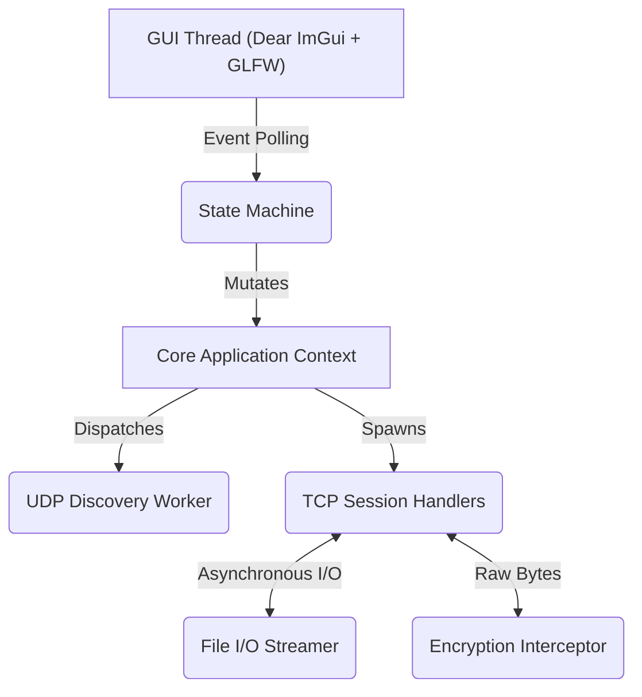

<div align="center">
  <h1>NexusLink</h1>
  <p><strong>Decentralized Peer-to-Peer LAN Communications & Raw Socket File Transfer Protocol</strong></p>
  
  [](https://isocpp.org/)
  [](https://cmake.org/)
  [](https://www.opengl.org/)
  [](https://opensource.org/licenses/MIT)
</div>

<br>

**NexusLink** is a high-performance, cross-platform Local Area Network (LAN) communication and raw byte-stream file transfer application. Built with **C++20**, the system implements a completely decentralized peer-to-peer (P2P) architecture, utilizing UDP datagram broadcasting for Zero-Config network discovery and highly engineered TCP socket handling for reliable data transmission. Graphical rendering is decoupled from core networking via a minimal **OpenGL** and **Dear ImGui** abstraction layer.

---

## 🛠 Systems Architecture

NexusLink is designed with strict boundaries between its event loops, network threads, and rendering abstractions. It guarantees an asynchronous, non-blocking UI state even under heavy I/O loads during gigabit-speed LAN transfers.



### Core Abstractions

1. **Network Topology & Discovery**: 
   - Uses **UDP IPv4 Broadcast** algorithms configured on `INADDR_BROADCAST`. The discovery worker thread continually listens on a bound port, identifying alive peer beacons and flushing stale nodes safely using atomic epoch timestamps.
2. **Deterministic TCP Transport**: 
   - Dedicated acceptor threads dispatch unique worker threads per peer session. Custom packet structuring involves an inherent payload header (OpCode + Length) to precisely manage the boundaries of continuous byte streams, preventing TCP fragmentation issues.
3. **Concurrency & Memory Management**: 
   - Engineered via `<thread>`, `<atomic>`, and `<mutex>` following standard C++20 concurrency guidelines. Lock contention is minimized by isolating buffer ingestion queues per thread context. Smart pointers (`std::shared_ptr`, `std::unique_ptr`) enforce predictable RAII-bound resource lifecycles over critical dynamic buffers.
4. **Immediate Mode UI Rendering**: 
   - ImGui avoids the state-synchronization overhead of traditional retained-mode GUIs. The rendering pipeline operates directly on the core atomic application state at 60+ FPS via a non-blocking GLFW context.

---

## 🚀 Build System (CMake)

The build utilizes CMake `FetchContent` for deterministic dependency resolution. The core systems are compartmentalized to support drop-in replacements for hashing, threading, or UI backends.

### Prerequisites
- **Compiler:** Clang, GCC, or MSVC with native C++20 support.
- **Build Generator:** CMake 3.16 or higher.
- **Dependencies:** Native OpenGL 3.3+ headers. GLFW and ImGui are statically vendored.

### POSIX (macOS & Linux)

```bash
# Generate deterministic build files
cmake -S . -B build/Release -DCMAKE_BUILD_TYPE=Release -DNEXUSLINK_ENABLE_GUI=ON

# Execute multithreaded compilation 
cmake --build build/Release -j $(sysctl -n hw.ncpu 2>/dev/null || nproc)

# macOS specific: Assemble validated .app bundle
cmake --build build/Release --target package_macos_app
```
*Output artefact:* `dist/NEXUSLINK.app`

### Windows (MSVC or MinGW-w64)

```powershell
# For MinGW cross-compilation environments:
cmake -S . -B build/Release -G "MinGW Makefiles" -DCMAKE_BUILD_TYPE=Release -DNEXUSLINK_ENABLE_GUI=ON
cmake --build build/Release -j %NUMBER_OF_PROCESSORS%
cmake --build build/Release --target package_dist
```
*Output artefact:* `dist/NexusLink.exe`

---

## 💻 Usage & Protocol Details

### Handshake & Session Ingestion
Upon launch, local sockets bind natively to `0.0.0.0` for incoming TCP (Session) and UDP (Beacon). Clients broadcast their arbitrary metadata (username, system ID) via UDP. Connecting to a peer initiates a 3-way TCP handshake, escalating to a NexusLink metadata exchange protocol.

### Transport Modes
- **0x01 [CHAT_PAYLOAD]**: Standard UTF-8 encoded text blobs buffered into the ImGui render queue.
- **0x02 [FILE_METADATA_HEADER]**: Ingests filename, CRC checks, and total expected byte size.
- **0x03 [FILE_CHUNK]**: Streamed byte chunks written sequentially to `data/downloads/`. Chunking prevents RAM exhaustion during massive multi-gigabyte file transfers.

## 📜 License

Licensed under the MIT License. See `LICENSE` for the full text. Code is provided "as is" and intended as an open-source technical reference for high-performance C++ networking.
